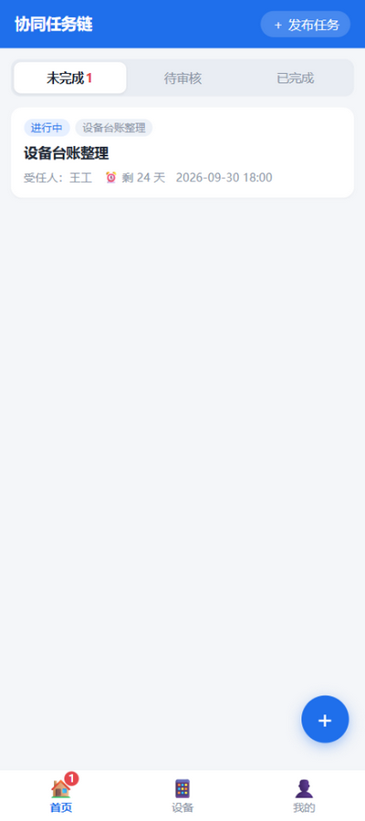
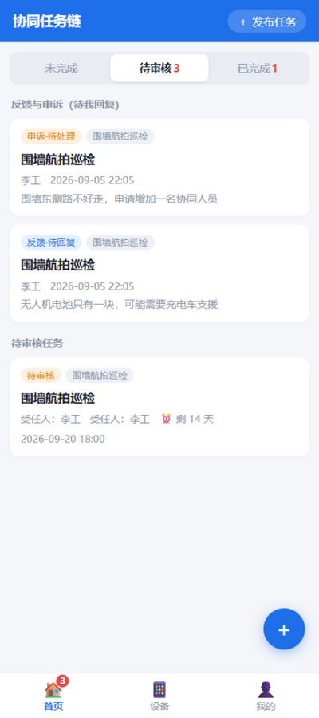
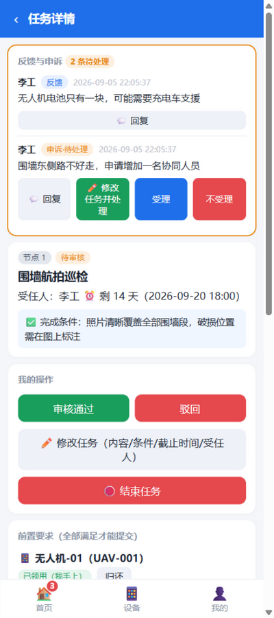
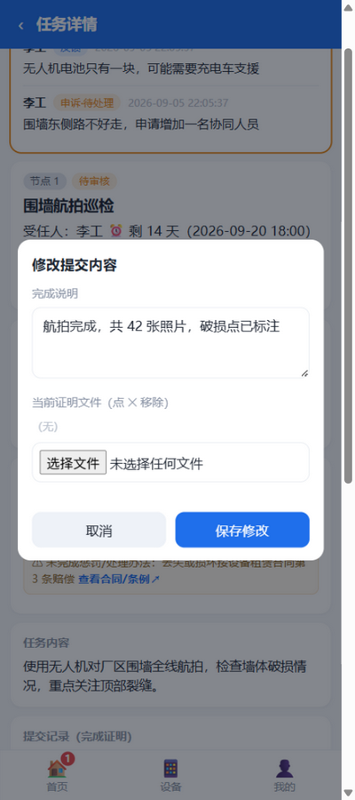
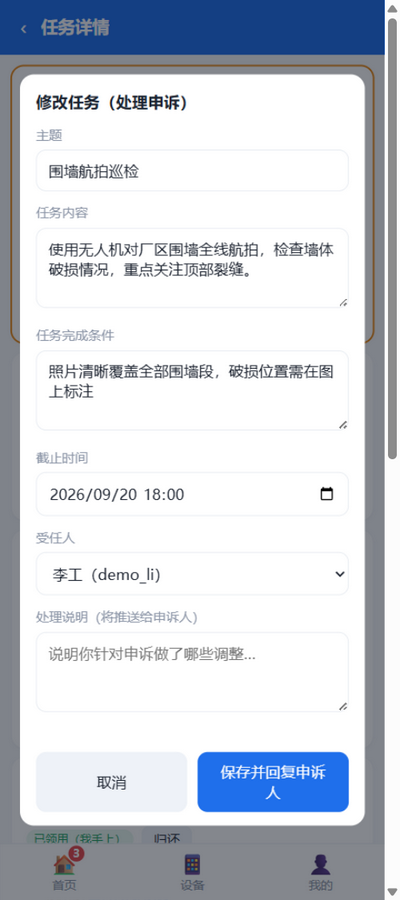
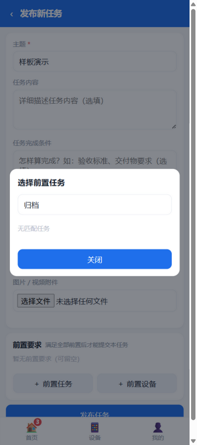
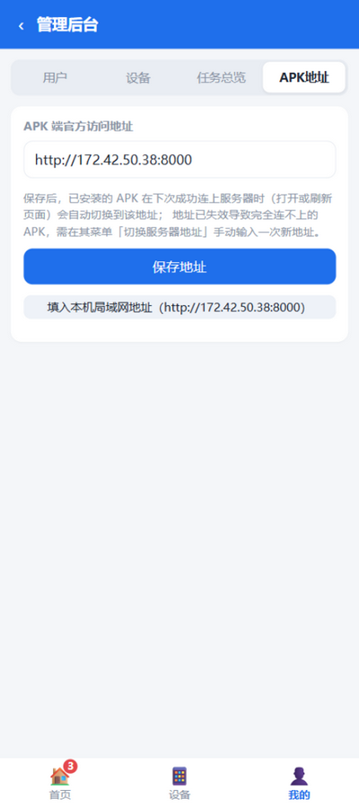

[中文](README.md) | English

# Task Chain

A **full-lifecycle task system** for "client ⇄ vendor" or "manager ⇄ subordinate" collaboration: publish → check out equipment → execute → submit → review → multi-node relay → terminate, with a complete audit trail.

Works as a web app (usable directly in the phone browser, nothing to install) and an Android app (WebView shell), served by one backend.

## Screenshots

| Login / register | Home (persistent counters + badges) |
| --- | --- |
|  |  |
| **Pending: feedback & appeal cards** | **Task detail: equipment prerequisite + criteria** |
|  |  |
| **Appeals pinned on top, reply / edit-and-resolve** | **Editable submission before review** |
|  |  |
| **Edit task (change summary auto-replied to appellant)** | **Searchable prerequisite picker** |
|  |  |
| **Admin console · devices** | **APK URL & rescue mailbox config** |
|  |  |

## Features

- **Task publishing**: title, description, image/video attachments, deadline, assignee, completion criteria.
- **Prerequisites**:
  - Prerequisite tasks (multiple allowed): submission is locked until they are approved; one tap jumps to the prerequisite's page; if you are its assignee, that page is your working page.
  - Prerequisite equipment: set by the publisher, optionally with penalty/handling terms and a hyperlink to the contract or regulation (one-tap jump from the detail page). The prerequisite text shows **black** when the equipment is free and **grey** when it is occupied.
- **Equipment management**: register equipment in the admin console; assignees **manually check out / return** equipment in the app; the system records who currently holds it and for which task; full custody history on the device page; admins can force-release.
- **Assignee actions**: send feedback to the publisher, appeal unreasonable requirements (publisher can reply and accept/reject), upload completion evidence (images/videos), submit for review.
- **Review**: submissions enter the pending-review list, reviewed by the **node creator** (approve, or reject with a mandatory reason; rejected tasks can be re-submitted).
- **Multi-node task chains**: once a node is approved, its **completer** creates the next node and assigns the next person; the chain initiator sees everything.
- **Termination**: any assignee may apply to terminate (double confirmation), reviewed by the **chain initiator**; the initiator can terminate directly. Termination ends the whole chain and is irreversible.
- **Home page**: everyone gets "Unfinished / Pending review / Completed" lists with badge counts, sorted by deadline (overdue highlighted in red); "Me" holds identity info and "My publications".
- **Open registration**: self-service sign-up from the login page (username 2-32 alphanumerics, password ≥8 chars); admins can still create accounts in the console.
- **APK address management**: the admin console sets the official APK server URL (with QR code); installed apps follow it automatically whenever they can reach the server.
- **Fixed-entry self rescue**: the console can push the official URL to a Gitee raw config file (free, reachable in China); an APK with the fixed entry configured recovers automatically on next launch even if its saved address is fully dead.
- **Phone notifications**: no persistent icon — the app checks immediately on open/background and then via system alarms about every 15 minutes; when something needs the logged-in user (new task, pending review, rejected, new feedback/appeal, appeal reply, termination request) a **system notification pops up** and tapping it opens that task.
- **APK distribution via server**: the latest APK is served by your own server at `http://server-address/apk` (public, no login) — phones never need to reach GitHub; the in-app update check asks the server first.
- **LAN auto discovery**: the server answers UDP broadcasts on port 9875; the APK discovers it automatically on first launch or on failure — **on the same Wi-Fi, install and connect with zero configuration**.
- **Rescue mailbox**: configure a dedicated mailbox in the console; every address change is emailed automatically and member APKs (which cached credentials on first successful connect) recover the new address via POP3 when lost. Provider comparison: [docs/entry-providers.md](docs/entry-providers.md) (Chinese).
- **Full audit trail**: every node's assignee and creator, plus a timeline of create/checkout/feedback/appeal/submit/review/termination/equipment events.

## Quick start (LAN, 3 minutes)

1. On the PC, double-click `start_server.bat` (a console window opens showing the URL and QR code; first run creates a venv and installs deps; requires Python 3.10+). To stop, double-click `stop_server.bat` or just close that window.
2. The default admin account is created automatically: **admin / admin123** (change it right away).
3. Log in as admin → "Me → Admin console" → register equipment, create user accounts.
4. On the phone (same Wi-Fi), open the LAN URL shown in the server window (a QR code is printed too), or install the Android app and enter the same address on first launch.
5. Optional: `python seed_demo.py` seeds demo users (zhangsan/lisi/wangwu, password 123456) and two demo devices.

## Android app

`android/` is a plain WebView shell project (no third-party dependencies):

- enter the server URL on first launch; cookies persist between runs;
- automatically follows the official URL configured in the admin console whenever reachable;
- system photo/file picker for image/video uploads;
- menu items to switch server address and clear login state.

To build: install the Android SDK (`platforms;android-34`) and Gradle 8.7, then run in `android/`:

```
gradle assembleDebug
```

The APK lands at `android/app/build/outputs/apk/debug/app-debug.apk`; sideload it on your phone.

## Business rules (design decisions, adjustable)

| Item | Rule |
| --- | --- |
| Prerequisite tasks | Must reference nodes of **other chains** (same-chain and cyclic references are rejected server-side); unlock submission when approved |
| Prerequisite equipment | The assignee must **check out and hold** the equipment to submit; terminating a chain does **not** auto-release equipment |
| Review rights | Each node is reviewed by its **creator**; node 1's creator is the chain initiator |
| Next-node creation | The current node's assignee (completer), after approval |
| Termination rights | Chain initiator (direct) + any node assignee of the chain (needs initiator review) |
| Deletion guard | Admin accounts can be neither deactivated nor deleted from the console (touch the database directly if ever needed); users who took part in tasks and devices referenced/occupied by tasks cannot be deleted (deactivate/release instead); unused ones can be deleted |
| Admin demotion/promotion | Admins can be demoted (keep account as normal member) and normal users promoted; the `admin` bootstrap account and the acting admin themselves cannot be demoted |
| Task deletion | Whole chains can only be deleted from the **admin console** (nodes, submissions and timeline removed together); chains referenced as prerequisites or with unreturned equipment are protected. Participants' "end task" is a soft ending that keeps records |
| Visibility | Chain initiator and node creators/assignees of a chain; admins see everything |
| Accounts | Self-registration on the login page or admin-created in the console; passwords must be ≥8 chars |

## Project layout

```
task-chain/
├── start_server.bat        # one-click server launcher (Windows)
├── run_server.py           # entry point (prints LAN URL + QR code)
├── seed_demo.py            # optional demo users/devices
├── test_api.py             # end-to-end API smoke test (87 assertions; run isolated via run_tests.ps1)
├── requirements.txt
├── app/                    # FastAPI backend
├── static/                 # SPA frontend (vanilla HTML/CSS/JS, no build step)
├── android/                # Android WebView shell project
└── tunnel/                 # frp tunnel templates & guide
```

## Tunneling (access from outside the LAN)

See [tunnel/README.md](tunnel/README.md): frp (your own VPS), Tailscale/ZeroTier networking, or commercial solutions.

**Security reminder** before exposing to the public internet: change the admin password and all weak passwords, and put the service behind an HTTPS reverse proxy.

## Development & testing

```
pip install -r requirements.txt requests
python -m uvicorn app.main:app --port 8000
python test_api.py        # delete data.db and run seed_demo.py first
```

## Known limitations / roadmap

- Attachments are stored on local disk; max 200MB per video.
- Notifications are in-app badges with 30s polling; no push notifications yet.
- Passwords are stored with PBKDF2-SHA256 (600k iterations + per-user salt); login locks for 15 minutes after 5 consecutive failures; no built-in HTTPS — **put behind a reverse proxy in production**, and change default/weak passwords before exposing to the internet.

## License

MIT
