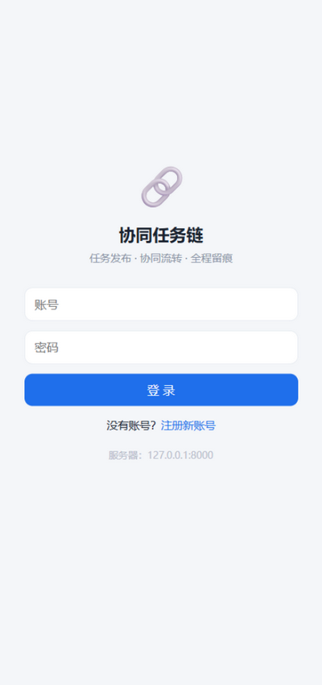
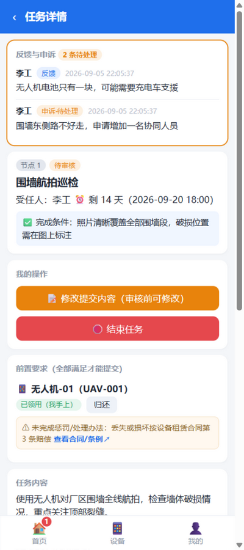
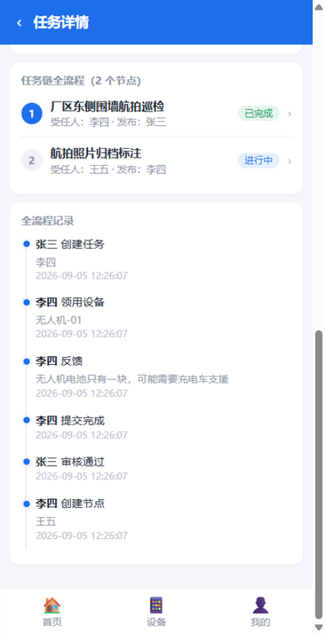
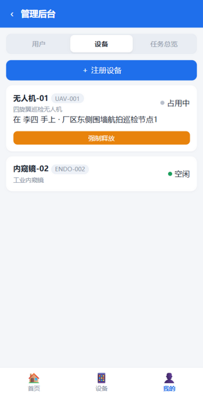

[English](README.en.md) | 中文

# 协同任务链

面向"甲方 ⇄ 乙方 / 领导 ⇄ 下属"协作场景的**任务全流程系统**：发布 → 领用 → 执行 → 提交 → 审核 → 多节点接力 → 结束，全程留痕可查。

网页端（手机浏览器即可用，无需安装）+ Android App（WebView 壳）双形态，一套后端同时服务。

## 界面预览

| 登录 | 任务详情（前置设备 + 我的操作） |
| --- | --- |
|  |  |
| **任务链全流程 + 时间线** | **管理后台 · 设备** |
|  |  |

## 功能特性

- **任务发布**：主题、内容、图片/视频附件、截止时间、受任人、任务完成条件。
- **前置要求**：
  - 前置任务（可多条）：前置任务完成前无法提交本任务；一键跳转前置任务页查看完成情况；若你就是前置任务的受任人，打开即是你的执行页面。
  - 前置设备：由发布者指定设备，可附"未按要求处理的惩罚/处理办法"与合同/条例超链接（详情页一键跳转）。设备**空闲**时前置字样为黑色，被占用时为灰色。
- **设备管理**：管理后台注册设备；受任人在 App 内**手动领用/归还**；系统记录设备当前在谁手上、用于哪个任务；设备详情页可查完整流转历史；管理员可强制释放。
- **受任人操作**：向发布者反馈、申诉任务不合理处（发布者可回复并受理/不受理）、上传完成证明（图片/视频）、提交任务完成。
- **审核**：提交后进入待审核，由**该节点创建者**通过或驳回（驳回需写明原因，驳回后可修改重报）。
- **多节点任务链**：节点审核通过后，由**上一节点完成者**创建下一节点并指定受任人，长链条逐级流转；链发起人（最初发布者）全程可见。
- **结束任务**：任意受任人可申请结束（二次确认），由**链发起人**审核；发起人本人结束直接生效。结束后整条链结束且不可恢复。
- **主页面**：所有人都有「未完成 / 待审核 / 已完成」三个列表 + 底部角标提示，距截止时间越近越前排（超期红色高亮）；「我的」= 身份信息 + 我的发布。
- **开放注册**：登录页可自助注册（账号 2-32 位字母/数字/下划线，密码≥8 位），也可由管理员在后台统一建号。
- **APK 地址管理**：管理后台可设置「APK 端官方访问地址」并生成二维码；已安装的 APK 联网时会自动跟随切换（彻底失联的地址需在 APK 菜单手动改一次）。
- **全流程留痕**：任务详情可查每一个节点的受任人、发布者，以及创建/领用/反馈/申诉/提交/审核/结束/设备流转的完整时间线。

## 快速开始（局域网，3 分钟）

1. 电脑上双击 `start_server.bat`（首次运行自动建虚拟环境装依赖；需 Python 3.10+）。
2. 首次启动自动创建管理员：**admin / admin123**（请立即登录修改密码）。
3. 管理员登录 →「我的 → 管理后台」→ 注册设备、创建用户账号。
4. 手机连**同一 WiFi**，浏览器打开启动窗口显示的局域网地址（控制台有二维码可扫），或安装 Android App 首次启动时填同一地址。
5. 可选：运行 `python seed_demo.py` 写入演示用户（zhangsan/lisi/wangwu，密码均 123456）与两台演示设备。

## Android App

`android/` 目录是原生 WebView 壳工程（无第三方依赖）：

- 首次启动输入服务器地址，Cookie 持久化保持登录；
- 联网时自动拉取管理后台设置的「官方访问地址」并跟随切换（局域网 IP 变了 / 启用穿透后无需逐台手机改）；
- 系统相册/文件选择器上传图片视频；
- 菜单支持切换服务器地址、清除登录状态。

自行构建：安装 Android SDK（platforms;android-34）与 Gradle 8.7 后，在 `android/` 目录执行：

```
gradle assembleDebug
```

产物在 `android/app/build/outputs/apk/debug/app-debug.apk`，传到手机安装即可（设置里允许安装未知来源）。

## 业务规则（设计决策，可按需调整）

| 事项 | 规则 |
| --- | --- |
| 前置任务 | 只能引用**其他任务链**的节点（禁止同链/循环依赖，服务端强校验）；该节点"审核通过"才解锁提交 |
| 前置设备 | 受任人须在 App 内**领用**且持有，才能提交；提交后仍持有会提醒归还；链结束**不会**自动释放设备 |
| 提交审核权 | 每个节点由**节点创建者**审核；节点 1 的创建者即链发起人 |
| 下一节点创建权 | 本节点受任人（完成者），审核通过后出现按钮 |
| 结束申请权 | 链发起人（直接生效）+ 该链任意节点的受任人（需发起人审核） |
| 删除保护 | 参与过任务的用户、被任务引用/占用中的设备**不可删除**（只能停用/先释放），从未使用的可直接删除，保证全流程留痕完整 |
| 任务删除 | 仅**管理后台**可删整条任务链（连节点/提交/时间线一并清除）；被其他链引用为前置、或仍有设备未归还的不可删。参与者的「结束任务」只是软结束，记录保留 |
| 数据可见性 | 链发起人、各节点创建者/受任人可见该链；管理员可见全部 |
| 账号 | 支持登录页自助注册，也可由管理员在后台创建；密码统一强制 ≥8 位 |

## 项目结构

```
task-chain/
├── start_server.bat        # 一键启动（Windows）
├── run_server.py           # 服务入口（打印局域网地址+二维码）
├── seed_demo.py            # 可选：写入演示用户/设备
├── test_api.py             # API 全流程冒烟测试（87 项断言，用 run_tests.ps1 隔离运行）
├── requirements.txt
├── app/
│   ├── main.py             # FastAPI 全部接口
│   ├── db.py               # SQLite 建表
│   └── util.py             # 密码哈希/会话/事件
├── static/                 # 前端 SPA（原生 HTML/CSS/JS，无构建步骤）
│   ├── index.html
│   ├── css/app.css
│   └── js/app.js
├── android/                # Android WebView 壳工程
└── tunnel/                 # frp 内网穿透模板与说明
```

## 内网穿透（外网使用）

见 [tunnel/README.md](tunnel/README.md)：支持 frp（自有云服务器）、Tailscale/ZeroTier 组网、花生壳三种方案。

**公网部署安全提醒**：先把 admin 与弱密码用户全部改成强密码，建议加 HTTPS。

## 开发与测试

```
pip install -r requirements.txt requests
python -m uvicorn app.main:app --port 8000
python test_api.py        # 需先删除 data.db 并运行 seed_demo.py
```

## 已知限制 / 后续计划

- 附件为本地磁盘存储，无转码；单视频上限 200MB。
- 消息提醒为页面角标 + 30 秒轮询，未接入系统推送。
- 密码使用 PBKDF2-SHA256（60 万次迭代 + 随机盐）存储；登录连续失败 5 次锁定 15 分钟；未做 HTTPS——**建议生产部署置于反向代理之后**，公网暴露前务必改掉默认/弱密码。

## License

MIT
